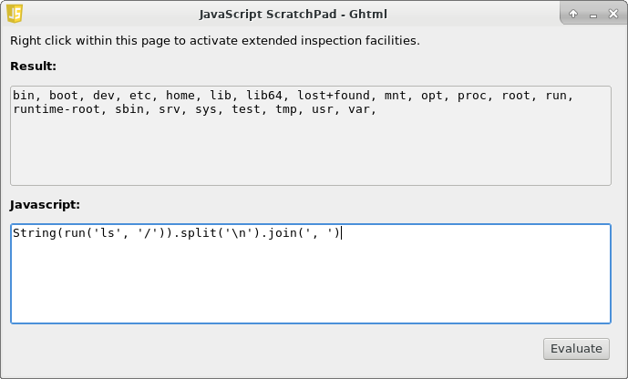

### About JSE
[JSE](https://github.com/hypersoft/jse/wiki/About-JSE) is a free (as in cost of 
purchase) and open-source computer software project for executing shell-scripts 
written in JavaScript within a Linux Operating System environment.

The JSE project is conceptualized and maintained by
[Hypersoft-Systems: U.-S.-A.](https://github.com/hypersoft/)
[(Triston J.Taylor)](mailto:pc.wiz.tt@gmail.com). [Donations](https://www.paypal.com/cgi-bin/webscr?cmd=_s-xclick&hosted_button_id=DG3H6F8DSG4BC)
in support of this project are welcome and are processed via pay-pal.

### Features
JSE provides many features to enhance your ability to write JavaScript based shell-scripts and
HTML Applications for the Linux platform. You can use JSE to do any of the following:

  - Write Basic JavaScripts (With JSE's Shell support)
  - Write Advanced JavaScripts (Using shared-system-libraries and JSE Plugins)
  - Create, Design and Debug: HTML Applications (with Advanced or Basic JavaScripting support)

In general, JSE IS a full-fledged-application-development-suite. If JSE doesn't
have the functionality you require built-in, you can simply create a plugin written
in the C programming language (or compatible) to create a plugin providing the
needed functionality. In fact, JSE itself is built on the use of plugins and
scripts to provide all of its core functionalities.

### HTML Application: Preview

This Screenshot demonstrates the power of combining the Shell and JavaScript 
within an HTML Application. The application shown is a manual JavaScript testing application
which is distributed with the source code of JSE, and can be found in the ./test folder.

Powerful applications can easily be written in no-time-at-all using JSE and Ghtml.
To execute the application shown in the Screenshot yourself, simply run:

    $ ./test/testbed

from a terminal session within the project's root directory after compiling and
installing the project.

### Recommended Reading for Script Writers
* [Wikipedia: JavaScript](http://en.wikipedia.org/wiki/JavaScript)
* [MDN: JavaScript](https://developer.mozilla.org/en-US/docs/Web/JavaScript)
* [JavaScript: The Definitive Guide](http://www.amazon.com/JavaScript-Definitive-Guide-David-Flanagan/dp/0596000480)
* [Unix Philosophy](http://en.wikipedia.org/wiki/Unix_philosophy)
